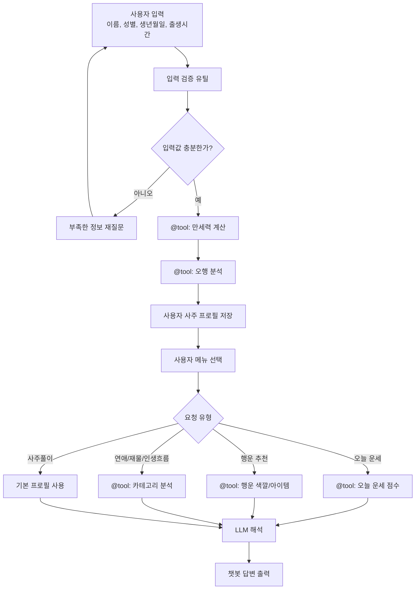

# 사주 챗봇 아키텍처 문서

## 1. 개요

이 문서는 사주 기반 자기성찰 챗봇의 작동 구조를 설명한다. 챗봇은 사용자의 이름, 성별, 생년월일, 출생시간, 양력/음력 여부를 입력받아 사주 원자료를 계산하고, 계산된 결과를 바탕으로 사주풀이, 오늘의 운세, 행운 점수, 행운 색깔, 행운 아이템, 연애운, 재물운, 인생흐름을 제공한다.

핵심 원칙은 다음과 같다.

- 사주 계산은 LLM이 직접 하지 않는다.
- 만세력, 오행, 점수 계산은 LangChain `@tool` 함수가 담당한다.
- LLM은 tool이 만든 구조화된 JSON 결과만 바탕으로 자연어 해석을 생성한다.
- 건강운은 의료적 오해를 줄이기 위해 기능 범위에서 제외한다.
- 결과는 엔터테인먼트 및 자기성찰 목적의 조언으로 제공한다.

## 2. 기능 범위

### 포함 기능

| 기능 | 설명 |
|---|---|
| 사주풀이 | 사주팔자와 오행 분석 결과를 바탕으로 성향, 강점, 주의점을 설명한다. |
| 오늘의 행운 점수 | 사용자 사주와 오늘 날짜의 기운을 비교해 점수를 계산한다. |
| 오늘의 운세 | 오늘의 점수와 분석 근거를 바탕으로 하루 조언을 제공한다. |
| 행운 색깔 | 보완이 필요한 오행을 색상으로 매핑한다. |
| 행운 아이템 | 보완 오행에 맞는 일상 아이템을 추천한다. |
| 연애운 | 관계, 소통, 감정 흐름 중심의 조언을 제공한다. |
| 재물운 | 소비 습관, 기회, 주의점 중심의 조언을 제공한다. |
| 인생흐름 | MVP에서는 원국 기반 초년, 청년, 중년, 후반 흐름을 간단히 해석한다. |

### 제외 기능

| 제외 항목 | 제외 이유 |
|---|---|
| 건강운 | 의료적 조언으로 오해될 수 있어 제외한다. |
| 질병, 수명, 사고 예측 | 민감하고 단정적 예측 위험이 크다. |
| 투자 수익, 합격, 당첨 예측 | 실제 의사결정에 영향을 줄 수 있어 제한한다. |
| 정통 대운 기반 인생흐름 | MVP에서는 난이도가 높으므로 원국 기반 간단 해석으로 제한한다. |

## 3. 사용자 흐름

```text
1. 사용자가 챗봇에 접속한다.

2. 기본 정보를 입력한다.
   - 이름
   - 성별
   - 생년월일
   - 출생시간
   - 양력/음력 여부

3. 앱이 입력값을 검증한다.
   - 필수값 누락 여부 확인
   - 날짜 형식 확인
   - 출생시간 미상 처리

4. 앱이 사용자 사주 프로필을 생성한다.
   - 만세력 계산
   - 오행 분석
   - 기본 프로필 저장

5. 사용자가 보고 싶은 메뉴를 선택한다.
   - 사주풀이
   - 오늘의 운세 / 행운 점수
   - 행운 색깔
   - 행운 아이템
   - 연애운
   - 재물운
   - 인생흐름

6. 앱이 메뉴에 필요한 tool만 실행한다.

7. LLM이 tool 결과를 자연어로 해석한다.

8. 사용자가 후속 질문을 한다.
   - "왜 그렇게 나왔어?"
   - "오늘 조심할 점만 알려줘"
   - "연애운을 더 자세히 봐줘"
```

## 4. 내부 처리 흐름

이 챗봇은 최초 프로필 생성 단계와 질문별 응답 단계를 분리한다. 이렇게 하면 매 질문마다 만세력 계산을 반복하지 않아도 되고, 필요한 tool만 실행할 수 있다.

### 4.1 최초 1회 프로필 생성

```text
사용자 입력
↓
입력 검증 유틸
↓
만세력 계산 tool
↓
오행 분석 tool
↓
사용자 사주 프로필 저장
```

### 4.2 질문별 응답 생성

```text
사용자 메뉴 선택 또는 자연어 질문
↓
질문 의도 분류
↓
필요한 tool만 실행
↓
분석 결과 JSON 생성
↓
LLM 해석 프롬프트 구성
↓
최종 답변 출력
```

### 4.3 전체 구조도



## 5. 컴포넌트 구성

| 컴포넌트 | 역할 |
|---|---|
| UI Layer | Streamlit 또는 Gradio 화면을 제공한다. 사용자 입력 폼과 챗봇 대화창을 담당한다. |
| Input Utility | 입력값 검증, 날짜 형식 변환, 출생시간 미상 처리 등 공통 전처리를 담당한다. 별도 tool로 만들지 않는다. |
| Tool Layer | LangChain `@tool` 데코레이터로 등록된 계산/분석 함수를 제공한다. |
| Orchestrator | 사용자 요청에 따라 필요한 tool만 호출하고 LLM에 전달할 JSON을 조립한다. |
| LLM Layer | tool 결과를 바탕으로 한국어 답변을 생성한다. 사주 계산은 직접 하지 않는다. |
| Storage Layer | 사용자 프로필, 사주 계산 결과, 대화 기록을 세션 상태 또는 SQLite/JSON에 저장한다. |
| Manseryeok Adapter | 만세력 계산 소스를 감싼다. `manseryeok-js`, 공공데이터 API, Python 라이브러리 중 하나로 교체 가능하게 둔다. |

## 6. LangChain Tool 설계

선생님 요구사항의 `@tool`은 LangChain에서 Python 함수를 LLM이 호출 가능한 tool로 등록하는 데코레이터로 해석한다.

입력 검증은 모든 기능이 공통으로 사용하는 전처리라서 별도 tool로 분리하지 않는다. 과제의 "4가지 이상의 tool" 조건은 아래 5개의 `@tool` 함수로 충족한다.

### Tool 1. 만세력 계산

```python
from langchain.tools import tool

@tool
def calculate_saju_chart(user_info_json: str) -> str:
    """사용자의 생년월일, 출생시간, 양력/음력 정보를 바탕으로 사주팔자를 계산한다."""
    ...
```

역할:

- 양력/음력 날짜 처리
- 년주, 월주, 일주, 시주 계산
- 필요 시 `manseryeok-js` 또는 공공데이터 API 호출
- 계산 결과를 JSON 문자열로 반환

### Tool 2. 오행 분석

```python
@tool
def analyze_five_elements(saju_chart_json: str) -> str:
    """사주팔자 데이터를 바탕으로 목, 화, 토, 금, 수 오행의 강약을 분석한다."""
    ...
```

역할:

- 천간/지지의 오행 매핑
- 오행 개수 계산
- 강한 오행, 약한 오행, 보완 오행 판단

### Tool 3. 오늘 운세 점수 계산

```python
@tool
def calculate_today_luck(profile_json: str) -> str:
    """사용자 사주 프로필과 오늘 날짜의 기운을 비교해 오늘의 행운 점수를 계산한다."""
    ...
```

역할:

- 오늘 날짜의 간지 또는 오행 계산
- 사용자의 부족한 오행을 보완하는지 확인
- 합/충 같은 간단 규칙을 반영
- 0~100점 사이의 행운 점수 반환

### Tool 4. 행운 색깔/아이템 추천

```python
@tool
def recommend_lucky_factors(element_analysis_json: str) -> str:
    """보완 오행을 기준으로 행운 색깔과 행운 아이템을 추천한다."""
    ...
```

역할:

- 오행을 색상으로 매핑
- 오행을 일상 아이템으로 매핑
- 추천 이유를 구조화된 데이터로 반환

예시 매핑:

| 오행 | 색깔 | 아이템 |
|---|---|---|
| 목 | 초록, 민트 | 식물, 노트, 나무 소재 소품 |
| 화 | 빨강, 분홍, 보라 | 조명, 향초, 따뜻한 음료 |
| 토 | 노랑, 베이지, 갈색 | 다이어리, 머그컵, 쿠션 |
| 금 | 흰색, 금색, 은색 | 시계, 펜, 금속 액세서리 |
| 수 | 검정, 남색, 파랑 | 물병, 향수, 이어폰 |

### Tool 5. 카테고리 운세 분석

```python
@tool
def analyze_luck_category(request_json: str) -> str:
    """연애운, 재물운, 인생흐름 요청에 필요한 분석 신호를 생성한다."""
    ...
```

역할:

- 연애운: 관계, 소통, 감정 표현 관련 신호 생성
- 재물운: 소비, 기회, 주의점 관련 신호 생성
- 인생흐름: 원국 기반 초년, 청년, 중년, 후반 흐름 생성
- LLM이 바로 문장화할 수 있는 근거 JSON 반환

## 7. 데이터 계약

### 7.1 사용자 입력

```json
{
  "name": "민지",
  "gender": "female",
  "birth_date": "1998-03-12",
  "birth_time": "09:00",
  "calendar_type": "solar",
  "birth_time_unknown": false
}
```

필드 설명:

| 필드 | 설명 |
|---|---|
| `name` | 답변에서 사용자를 부르기 위한 이름 |
| `gender` | 일부 전통 해석이나 확장 기능에 사용할 수 있는 값 |
| `birth_date` | YYYY-MM-DD 형식 생년월일 |
| `birth_time` | HH:MM 형식 출생시간 |
| `calendar_type` | `solar` 또는 `lunar` |
| `birth_time_unknown` | 출생시간 미상 여부 |

### 7.2 사주 프로필

```json
{
  "user": {
    "name": "민지",
    "gender": "female",
    "birth_date": "1998-03-12",
    "birth_time": "09:00",
    "calendar_type": "solar"
  },
  "saju_chart": {
    "year_pillar": "무인",
    "month_pillar": "을묘",
    "day_pillar": "예시",
    "hour_pillar": "예시",
    "time_precision": "known"
  },
  "five_elements": {
    "wood": 3,
    "fire": 1,
    "earth": 2,
    "metal": 1,
    "water": 1,
    "strong_element": "wood",
    "weak_element": "water",
    "recommended_element": "water"
  }
}
```

### 7.3 오늘 운세 결과

```json
{
  "date": "2026-06-24",
  "score": 82,
  "score_range": "0-100",
  "today_element": "water",
  "recommended_element": "water",
  "signals": [
    "오늘의 기운이 부족한 수 기운을 보완합니다.",
    "계획을 정리하고 감정을 차분히 다루기 좋은 흐름입니다."
  ],
  "cautions": [
    "중요한 결정을 서두르기보다 한 번 더 확인하는 편이 좋습니다."
  ]
}
```

### 7.4 LLM 입력 패키지

```json
{
  "intent": "today_luck",
  "profile": {
    "name": "민지",
    "saju_chart": {
      "year_pillar": "무인",
      "month_pillar": "을묘",
      "day_pillar": "예시",
      "hour_pillar": "예시"
    },
    "five_elements": {
      "strong_element": "wood",
      "weak_element": "water",
      "recommended_element": "water"
    }
  },
  "tool_result": {
    "score": 82,
    "lucky_color": "파란색",
    "lucky_item": "물병",
    "signals": [
      "오늘의 기운이 부족한 수 기운을 보완합니다."
    ]
  },
  "answer_policy": {
    "purpose": "entertainment_and_self_reflection",
    "avoid": [
      "medical_advice",
      "investment_advice",
      "absolute_prediction"
    ]
  }
}
```

## 8. LLM 프롬프트 정책

LLM에는 다음 규칙을 시스템 프롬프트 또는 개발자 프롬프트로 넣는다.

```text
너는 사주 계산을 직접 하지 않는다.
아래 JSON에 있는 tool 결과만 근거로 해석한다.
JSON에 없는 정보는 추측하지 않는다.
계산 결과가 비어 있거나 불확실하면 "계산되지 않음" 또는 "출생시간 정보가 부족해 제한적으로 해석합니다"라고 말한다.
건강, 질병, 수명, 사고, 투자 수익, 합격, 당첨 등은 단정하지 않는다.
답변은 엔터테인먼트와 자기성찰용 조언으로 작성한다.
사용자가 실제 의사결정을 하도록 압박하지 않는다.
```

권장 답변 톤:

- 단정형 예언보다 조언형 문장 사용
- "반드시", "무조건", "위험하다" 같은 표현 제한
- "오늘은 이런 흐름으로 해석할 수 있습니다" 같은 완화 표현 사용
- 계산 근거를 짧게 설명

## 9. 저장 전략

MVP에서는 Streamlit `session_state` 또는 Gradio `State`로 사용자 프로필을 저장한다. 제출물 완성도를 높이고 싶으면 SQLite나 JSON 파일 저장을 추가한다.

### MVP 저장

| 저장 대상 | 저장 위치 |
|---|---|
| 현재 사용자 입력 | 세션 상태 |
| 사주 프로필 | 세션 상태 |
| 최근 대화 | 세션 상태 |

### 확장 저장

| 저장 대상 | 저장 위치 |
|---|---|
| 사용자 프로필 | SQLite `users` 테이블 |
| 사주 계산 결과 | SQLite `saju_profiles` 테이블 |
| 대화 기록 | SQLite `chat_logs` 테이블 |

## 10. 만세력 계산 소스 전략

만세력 계산은 별도 어댑터로 감싼다. 이렇게 하면 계산 소스를 나중에 바꿔도 나머지 코드가 크게 흔들리지 않는다.

### 후보 1. `manseryeok-js`

장점:

- 사주팔자, 60갑자, 24절기 등 사주 계산에 가까운 기능을 제공한다.
- 별도 API 키 없이 로컬에서 계산할 수 있다.

주의점:

- JavaScript/TypeScript 라이브러리라 Python Streamlit/Gradio 앱에서 바로 쓰기 어렵다.
- Python에서 사용하려면 Node.js 스크립트를 별도로 실행하거나 API 형태로 감싸야 한다.

### 후보 2. 공공데이터포털 / 한국천문연구원 API

장점:

- 공신력 있는 음양력 데이터를 사용할 수 있다.
- Python에서 `requests`로 호출하기 쉽다.

주의점:

- API 키가 필요하다.
- 사주팔자 전체 계산은 추가 로직이 필요할 수 있다.

### 후보 3. Python 음력 변환 라이브러리

장점:

- Python 앱과 통합이 쉽다.
- 과제 MVP 구현 속도가 빠르다.

주의점:

- 정통 만세력 수준의 절기/간지 계산은 직접 보완해야 할 수 있다.

### 권장 결정

MVP에서는 계산 어댑터 인터페이스를 먼저 고정한다.

```text
input: 사용자 생년월일, 출생시간, 양력/음력
output: 년주, 월주, 일주, 시주, 음력 날짜, 계산 신뢰도
```

그 뒤 팀 역량에 따라 `manseryeok-js` 또는 공공 API를 연결한다.

## 11. 에러 처리

| 상황 | 처리 방식 |
|---|---|
| 생년월일 누락 | 사용자에게 생년월일을 다시 요청한다. |
| 날짜 형식 오류 | YYYY-MM-DD 예시를 보여준다. |
| 출생시간 미상 | 시주는 계산하지 않거나 `time_precision: unknown`으로 표시한다. |
| 양력/음력 미선택 | 양력인지 음력인지 다시 질문한다. |
| 만세력 계산 실패 | 계산 실패 메시지와 재입력 안내를 제공한다. |
| LLM 응답 실패 | tool 결과 기반의 짧은 기본 답변을 반환한다. |
| 지원 범위 밖 날짜 | 지원 가능한 연도 범위를 안내한다. |

## 12. 보안 및 안전 정책

이 챗봇은 개인의 생년월일과 이름을 입력받는다. 과제용 서비스라도 다음 원칙을 지킨다.

- API 키는 `.env`에 저장하고 GitHub에 올리지 않는다.
- 사용자 생년월일과 대화 기록은 불필요하게 오래 저장하지 않는다.
- 발표용 데모 데이터는 가상 인물 정보를 사용한다.
- 건강, 질병, 수명, 사고, 투자, 합격 같은 민감 영역은 단정하지 않는다.
- 서비스 첫 화면 또는 결과 하단에 엔터테인먼트/자기성찰 목적 안내문을 둔다.

안내 문구 예시:

```text
본 서비스는 전통 명리학 요소를 활용한 엔터테인먼트 및 자기성찰용 챗봇입니다.
의학, 법률, 금융 등 중요한 의사결정의 근거로 사용하지 마세요.
```

## 13. 기술 스택

| 구분 | 후보 |
|---|---|
| UI 프레임워크 | Streamlit 또는 Gradio |
| LLM Orchestration | LangChain |
| Tool 구현 | LangChain `@tool` |
| LLM API | OpenAI API 또는 Gemini API |
| 만세력 계산 | `manseryeok-js`, 공공데이터 API, Python 음력 변환 라이브러리 중 선택 |
| 저장소 | MVP: 세션 상태, 확장: SQLite 또는 JSON |
| 환경 변수 | `python-dotenv` |
| 배포 | Streamlit Community Cloud, Hugging Face Spaces, Render |
| 개발 도구 | VS Code, GitHub, ChatGPT/Codex |

## 14. 팀원 역할 분담 예시

| 역할 | 담당 기능 |
|---|---|
| 팀원 A | 만세력 계산 tool 구현 |
| 팀원 B | 오행 분석 tool 구현 |
| 팀원 C | 오늘 운세 점수 tool 구현 |
| 팀원 D | 행운 색깔/아이템 추천 tool 구현 |
| 팀원 E 또는 공통 | LLM 프롬프트, UI, 발표 자료 정리 |

팀원이 4명이라면 Tool 4와 Tool 5를 한 명이 묶어서 맡거나, LLM/UI 담당자가 카테고리 운세 분석 tool을 함께 맡는다.

## 15. 구현 순서

1. UI 입력 폼을 만든다.
2. 입력 검증 유틸을 만든다.
3. `calculate_saju_chart` tool을 만든다.
4. `analyze_five_elements` tool을 만든다.
5. `calculate_today_luck` tool을 만든다.
6. `recommend_lucky_factors` tool을 만든다.
7. `analyze_luck_category` tool을 만든다.
8. LLM 프롬프트를 연결한다.
9. Streamlit/Gradio 챗봇 화면에 결과를 출력한다.
10. 데모용 입력값으로 발표 시나리오를 검증한다.

## 16. 테스트 전략

| 테스트 대상 | 검증 내용 |
|---|---|
| 입력 검증 유틸 | 잘못된 날짜, 누락값, 출생시간 미상 처리 |
| 만세력 계산 tool | 샘플 생년월일에 대해 결과 형식이 안정적인지 확인 |
| 오행 분석 tool | 오행 개수 합계와 강약 판단이 일관적인지 확인 |
| 오늘 운세 점수 tool | 점수가 0~100 범위를 벗어나지 않는지 확인 |
| 행운 추천 tool | 보완 오행에 맞는 색깔/아이템이 반환되는지 확인 |
| LLM 프롬프트 | 없는 정보를 지어내지 않는지 확인 |
| UI 흐름 | 사용자가 입력부터 결과 확인까지 막히지 않는지 확인 |

## 17. 주요 설계 결정

### 17.1 입력 검증은 tool이 아니라 유틸 함수로 둔다

입력 검증은 모든 tool이 공유하는 전처리다. 별도 `@tool`로 만들면 과제의 tool 개수는 늘어나지만, 실제 기능 단위로는 약하다. 따라서 입력 검증은 공통 유틸 함수로 두고, 발표에서는 계산/분석 중심 tool을 보여준다.

### 17.2 LLM은 계산하지 않고 해석만 한다

LLM에게 생년월일만 넘기면 사주 계산을 지어낼 수 있다. 이를 막기 위해 계산은 deterministic tool이 담당한다. deterministic tool은 같은 입력에 대해 같은 결과를 내는 코드 기반 함수를 뜻한다.

### 17.3 모든 요청에서 모든 tool을 호출하지 않는다

사용자가 "연애운"만 물었는데 오늘 운세 점수와 행운 아이템까지 매번 계산하면 비효율적이다. 최초 1회 사주 프로필을 만들고, 이후에는 메뉴에 필요한 tool만 호출한다.

### 17.4 인생흐름은 MVP에서 간단 해석으로 제한한다

정통 대운 계산은 절기, 순행/역행, 시작 나이 계산 등이 필요하다. MVP에서는 사주 원국과 오행 균형을 바탕으로 초년, 청년, 중년, 후반 흐름을 설명한다. 발표에서는 "대운 기반 정밀 분석은 확장 기능"이라고 설명한다.

## 18. 발표용 요약

이 챗봇은 사용자의 생년월일과 출생시간을 바탕으로 만세력과 오행을 계산하고, 계산된 JSON 데이터를 LLM이 해석하여 사주풀이, 오늘의 운세, 행운 점수, 행운 색깔, 행운 아이템, 연애운, 재물운, 인생흐름을 제공하는 서비스다.

LLM 환각을 줄이기 위해 사주 계산은 LangChain `@tool`로 정의한 deterministic tool이 담당하고, LLM은 tool 결과를 자연어로 설명하는 역할만 맡는다. 건강운은 의료적 오해를 줄이기 위해 제외했다.
