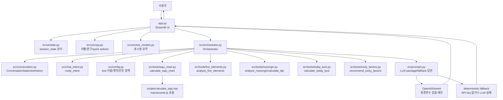
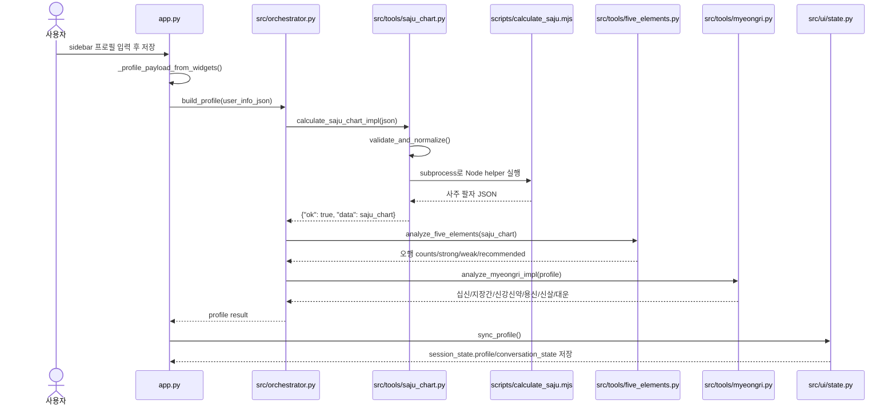
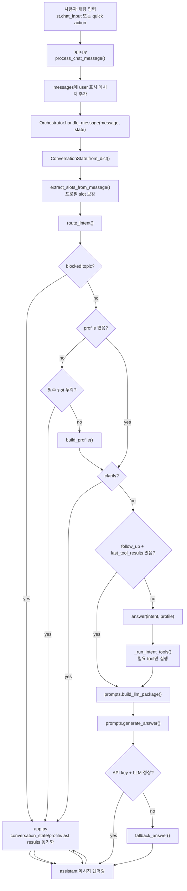
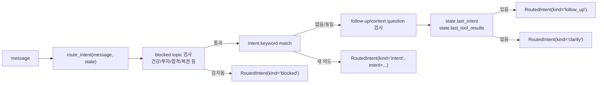
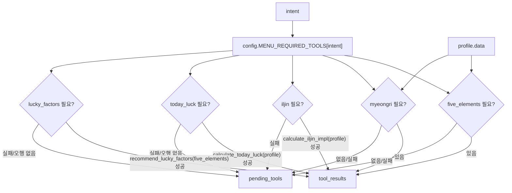
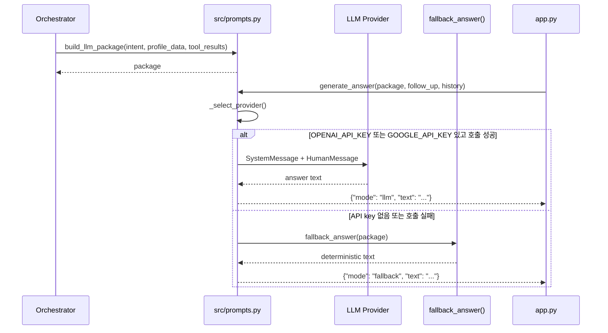
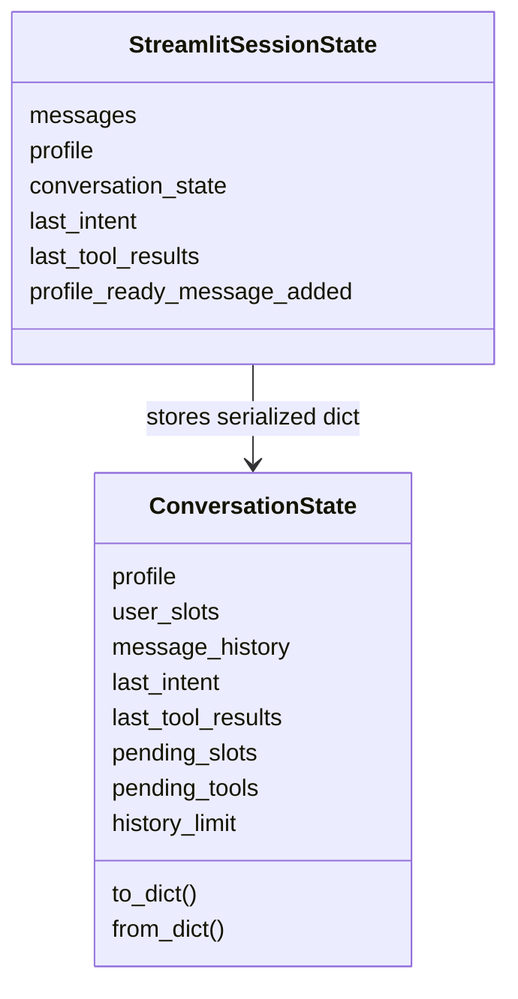
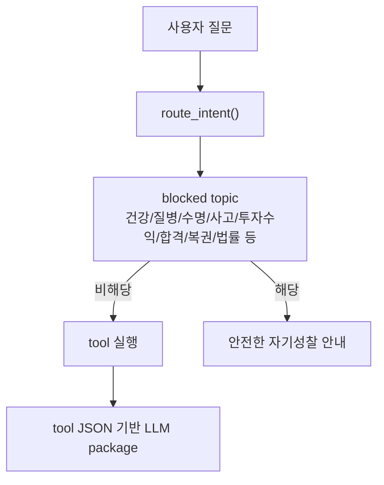

# 프로젝트 작동 흐름

이 문서는 KDA Chatbot이 실제 파일과 코드 기준으로 어떻게 동작하는지 설명한다. 핵심 흐름은 Streamlit UI가 사용자 입력을 받고, `Orchestrator`가 의도를 라우팅한 뒤, deterministic tool JSON만 계산 근거로 삼아 LLM 또는 fallback 답변을 만드는 구조다.

## 전체 구조



## 최초 프로필 저장 흐름

사용자가 sidebar에서 이름, 성별, 생년월일, 출생시간, 양력/음력 정보를 저장하면 `app.py`의 `save_profile()`이 실행된다.



프로필 생성에서 반드시 성공해야 하는 도구는 `calculate_saju_chart`다. 오행 또는 명리 해석 도구가 실패하면 앱은 가능한 범위에서 graceful하게 `pending_tools`에 기록한다.

## 일반 채팅 답변 흐름

채팅 입력 또는 quick action은 `process_chat_message()`로 들어간다. 현재 코드에서는 `Orchestrator.handle_message()`가 있으면 그 경로를 우선 사용한다.



## 의도 라우팅과 후속 질문

`src/chat_intent.py`는 키워드 기반으로 의도를 정한다. 지원 의도는 `saju_reading`, `today_fortune`, `luck_score`, `lucky_color`, `lucky_item`, `love`, `wealth`, `life_flow`다.



후속 질문은 이전 답변의 `last_intent`와 `last_tool_results`를 재사용한다. 그래서 "왜?", "더 자세히", "그 이유는?" 같은 질문에서는 프로필 계산을 다시 하지 않고 기존 tool JSON을 근거로 답변한다.

## 의도별 실행 도구

의도별 필요 도구는 `src/config.py`의 `MENU_REQUIRED_TOOLS`가 정한다. `Orchestrator._run_intent_tools()`는 이 목록을 보고 필요한 도구만 실행하거나 이미 프로필에 있는 결과를 재사용한다.



## 답변 생성 흐름

`src/prompts.py`는 계산을 하지 않는다. `profile.saju_chart`, `profile.five_elements`, `tool_result`만 계산 근거로 패키징하고, 환경변수에 따라 LLM 또는 fallback을 선택한다.



## 파일별 책임 요약

| 파일 | 책임 |
| --- | --- |
| `app.py` | Streamlit 진입점. sidebar 프로필 입력, quick action, chat input, session_state 동기화, 답변 렌더링을 담당한다. |
| `src/orchestrator.py` | 앱의 중심 조정자. 프로필 생성, 자연어 채팅 처리, 의도별 tool 실행, LLM package 생성을 연결한다. |
| `src/conversation.py` | UI와 독립적인 대화 상태 모델. 메시지 history, slot 추출, 누락 slot 검사, 직렬화를 담당한다. |
| `src/chat_intent.py` | 안전 차단, 의도 라우팅, 후속 질문 감지를 담당한다. |
| `src/config.py` | 공통 JSON 계약, 에러 코드, tool 이름, 의도별 필요 도구, 안전 정책 상수를 담는다. |
| `src/prompts.py` | LLM 입력 패키지, system/user prompt, provider 선택, deterministic fallback 답변을 담당한다. |
| `src/tools/saju_chart.py` | 입력 검증 후 Node helper를 subprocess로 호출해 사주 팔자를 계산한다. |
| `scripts/calculate_saju.mjs` | `@fullstackfamily/manseryeok`를 사용해 양력/음력 변환과 사주 팔자 계산을 수행한다. |
| `src/tools/five_elements.py` | 사주 팔자에서 오행 개수, 강한 오행, 약한 오행, 보완 오행을 계산한다. |
| `src/tools/myeongri.py` | 십신, 지장간, 신강/신약, 용신 근사, 신살, 대운, 일진을 계산한다. |
| `src/tools/today_luck.py` | 프로필과 오행 분석을 바탕으로 오늘의 운 점수와 신호를 계산한다. |
| `src/tools/lucky_factors.py` | 보완 오행을 기준으로 lucky color/item 추천 JSON을 만든다. |
| `src/ui/state.py` | Streamlit `session_state` key와 안전한 mutation helper를 제공한다. |
| `src/ui/copy.py` | UI 라벨, 안내문, quick action 문구를 제공한다. |
| `src/ui/view_models.py` | profile summary, pending tool 표시 등 UI 표시용 데이터를 만든다. |

## 상태 저장 모델



`app.py`의 화면용 `messages`와 `ConversationState.message_history`는 목적이 다르다. `messages`는 Streamlit 렌더링용이고, `message_history`는 후속 질문 문맥용이다.

## 안전 경계



금지 주제는 tool 실행 전에 차단된다. LLM도 계산 근거를 만들지 않으며, tool JSON에 없는 정보를 추측하지 않도록 prompt와 fallback 양쪽에서 제한한다.

## 검증 포인트

이 흐름을 수정했다면 최소한 아래 명령을 확인한다.

```powershell
pytest --collect-only -q
pytest -q
echo '{"birth_date":"1998-03-12","birth_time":"09:00","calendar_type":"solar"}' | node scripts/calculate_saju.mjs
```

Streamlit UI까지 확인해야 하는 변경이라면 다음 명령으로 앱을 띄운다.

```powershell
streamlit run app.py
```
